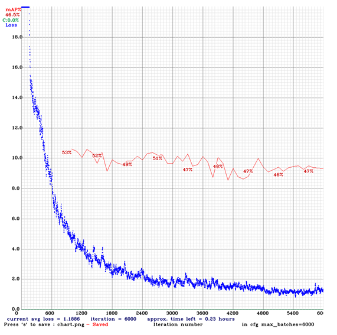

# YOLOv4 ve OpenCV Kullanarak Çiçek Türlerini Tespit Etme

Bu proje, YOLOv4 nesne tespit modeli ve OpenCV kullanılarak farklı çiçek türlerinin tespiti ve sınıflandırılmasını içermektedir. Model, özenle etiketlenmiş bir özel veri seti üzerinde eğitilmiş ve değerlendirilmiştir.

## Veri Seti
- **Toplam Görüntü:** 842
  - **Eğitim Görüntüleri:** 642
  - **Test Görüntüleri:** 200
- **Toplam Etiket:** Veri setindeki çiçek türleri için 1.368 etiket kullanıldı.

### Etiketleme Aracı
makesense.ai

## Model
- **Mimari:** YOLOv4
- **Framework:** Görüntülerin ön işlenmesi ve YOLOv4 modelinin çıkarım için entegrasyonu OpenCV kullanılarak gerçekleştirildi.
- **Sınıflar:** Model, papatya, gül ve karanfil olmak üzere 3 farklı çiçek türünü tespit etmek ve sınıflandırmak üzere eğitilmiştir.

## Eğitim
- **Eğitim Verisi:** 642 görüntü
- **Test Verisi:** 200 görüntü
- **Framework:** Darknet (YOLOv4 uygulaması)

## Sonuçlar
Model, çiçek türlerini doğru bir şekilde tespit etmek ve sınıflandırmak için test veri seti üzerinde değerlendirilmiştir. Aşağıda örnek bir tespit görseli bulunmaktadır:

### Ağırlık Dosyası
Ağırlık dosyası ([https://drive.google.com/link](https://drive.google.com/file/d/1YcZNLYbTVCQEIRkX527ZyFTJgZq05_gx/view?usp=sharing)).

## Lisans
Bu proje MIT Lisansı altında lisanslanmıştır. Detaylar için [LICENSE](./LICENSE) dosyasına bakın.
